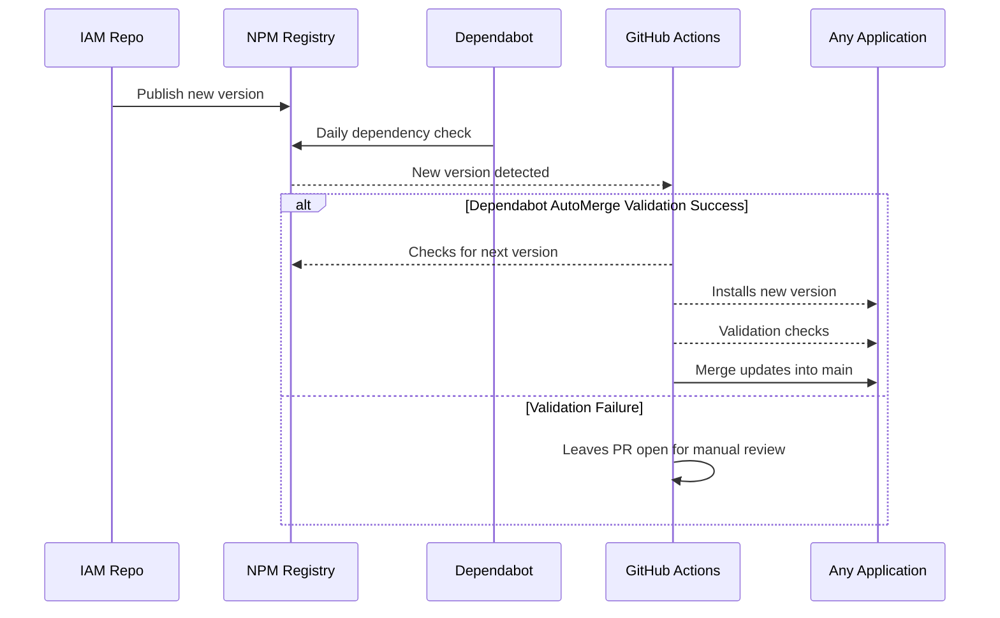

# Case Study

Setting up a TypeScript development studio involves significant preparation, from configuring
consistent coding standards to efficiently onboarding developers. The complexity and redundancy of
starting each project from scratch can slow down productivity and affect project timelines. Here’s
how a versatile TypeScript platform was developed to streamline this process.

## Discover

Launching and operating a TypeScript-focused development studio requires efficient management of
project setups, developer onboarding, and maintaining code consistency. Without standardized tools
and processes, considerable time and resources can be wasted on repetitive tasks and resolving
inconsistencies.

## Define

"Establish a development platform supported by a single developer that allows new projects to go
from '0 to Hello World' in five minutes or less."

## Requirements

The platform needed to:

- Deliver speed and quality without compromises—templates must be instantly ready like Quick
  Reaction Force (QRF).
- Enforce consistency through standardized coding practices and style guides.
- Be maintainable and operable by a single developer.
- Enable integration of any area of expertise into a React application within minutes, using **NPM**
  as a facade.

## Restrictions

NPM as the sole integration method: The platform's components must be exclusively installed and
integrated through NPM. This ensures modularity and reusability, making it straightforward to
integrate platform modules into any new or existing React application. This applies to applications
within the studio/org or any React application of a client. Below is an example.

Example: The platform’s QA module can be set up and running in a new client's app within five
minutes simply by installing it through NPM.

**Key objectives:**

- **Accelerate Developer Onboarding:** Minimize initial setup time to under five minutes.
- **Reduce Technical Debt:** Implement centralized coding standards across all TypeScript projects.
- **Boost Productivity:** Automate routine tasks related to code formatting, dependency management,
  and CI/CD workflows.

## Develop

A distributed platform using NPM as a central hub was developed, allowing seamless interaction among
various critical project execution areas:

- **[Quality Assurance (QA):](https://kurocado-studio.github.io/qa)** Centralized solutions for
  automated testing frameworks, methodologies, and strategies to ensure reliable quality control
  across all projects. This includes standardized testing libraries, configurations, and CI
  integration for automated validation.
- **[Identity and Access Management (IAM):](https://kurocado-studio.github.io/iam)** Centralized
  authentication managed through Auth0 by Okta, ensuring consistent, secure access management across
  multiple applications.
- **[DevOps:](https://kurocado-studio.github.io/dev-ops)** Unified GitHub Actions to automate
  workflows such as continuous integration (CI), continuous deployment (CD), and routine maintenance
  tasks, providing consistency and efficiency at an organizational scale.
- **Developer Experience (DX):** Enhanced developer productivity through utilities like axios
  wrappers for simplified API interactions, reusable React hooks for common tasks, and streamlined
  form-handling libraries.
- **[Engineering Style Guide](https://kurocado-studio.github.io/styleguide):** Enforced uniformity
  in coding standards, including linting, formatting, and commit conventions, ensuring consistent
  code quality and reducing overhead during code reviews.
- **[Design System:](https://kurocado-studio.github.io/design-system)** A comprehensive library of
  reusable UI components, styles, and guidelines to ensure visual and functional consistency across
  all projects.

Each area was organized into its own repository, providing flexibility in management, scalability,
and delegation. This structure allowed each area to independently decide on adopting a monorepo
setup, such as Turborepo, where beneficial. Automation through Dependabot and GitHub Actions ensured
dependencies stayed secure and compliant with automated daily updates.

## Deliver

The final delivery of this process is represented by the **Quick Reaction Force (QRF) Templates.** A
Quick Reaction Force, or QRF, is a small group of soldiers that stays ready to rapidly respond to
sudden situations. Their job is to be on standby and quickly deploy—usually within minutes.

This is why I've created these GitHub repositories—they serve as my Quick Reaction Force (QRF) for
software projects. Each repository includes all the configurations, dependencies, and setup needed,
allowing me to launch a fully functional project instantly. With these repos, I'm always prepared to
start new client work, demo concepts live, or quickly prototype solutions at any given moment,
without losing valuable time on initial setup.

**[See temples here](Templates.md)**

## Results and Impact

The implementation of this platform significantly improved operational efficiency:

- **Rapid Initialization:** Project setup consistently achieved within five minutes or less.
- **Enhanced Productivity:** Over 85% reduction in repetitive setup tasks.
- **Adaptability and Scalability:** Simplified knowledge transfer and enhanced collaboration between
  internal and external contributors.

## Looking Ahead

The platform will continue to evolve, with ongoing integration of additional tools such as DangerJS
and continued migration from JavaScript to TypeScript. Continuous refinement aims to sustain rapid
onboarding capabilities, facilitating scalable and efficient development operations.
