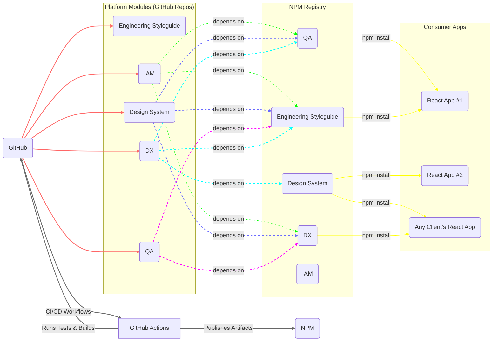
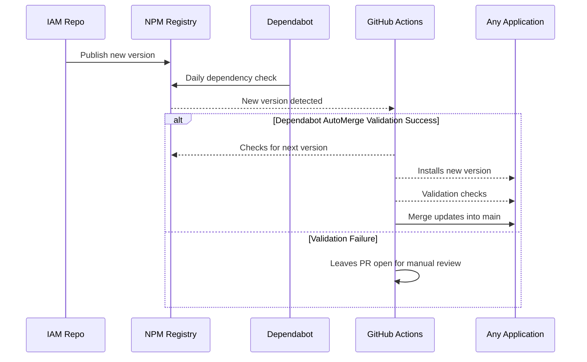
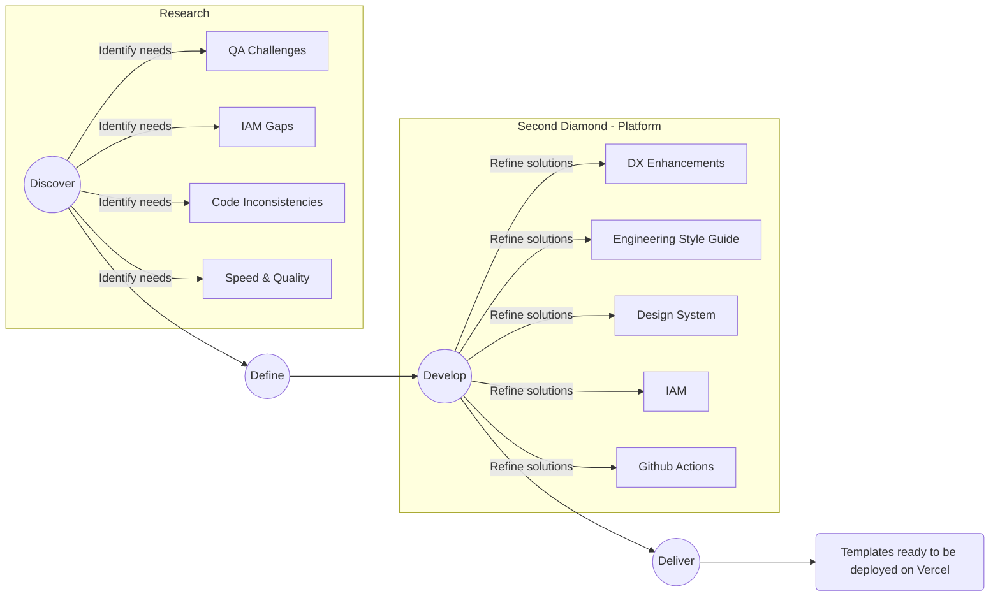

# Case Study

Setting up a TypeScript development studio involves significant preparation, from configuring
consistent coding standards to efficiently onboarding developers. The complexity and redundancy of
starting each project from scratch can slow down productivity and affect project timelines. Here’s
how a versatile TypeScript platform was developed to streamline this process.

## Discover

In preparing a TypeScript-focused development studio, I examined multiple established styleguides,
including the well-known Airbnb guide and the (now sunsetted) Vercel engineering styleguide. The
goal was to unify their strongest points into a single source of truth for linting, formatting, and
commit conventions—ensuring that any new project automatically adheres to proven best practices.

Through this process, I realized how essential it was to minimize repetitive setup tasks.
Researching various boilerplates and scaffolding tools helped confirm that a standardized
template—coupled with robust DevOps workflows—would allow projects to spin up in under five minutes.
At the same time, I reviewed monorepo strategies to see if consolidating everything in one place
made sense, but ultimately decided a modular, multi-repo approach worked best for enabling partial
integration via NPM.

Above all, the driving principle was a “write once” philosophy: standardize as many aspects of the
development environment as possible so I can focus on other platform components without sacrificing
speed or consistency. This discovery work shaped the final platform requirements, especially around
NPM-based modularization, consistent coding standards, and maintainability by a single developer or
small teams.

## Define

"Establish a development platform supported by a single developer that allows new projects to go
from '0 to Hello World' in five minutes or less."

## Requirements

The platform needed to:

- Deliver speed and quality without compromises—templates must be instantly ready like Quick
  Reaction Force (QRF).
- Enforce consistency through standardized coding practices and style guides.
- Be maintainable and operable by a single developer.
- Enable integration of any area of expertise into a React application within minutes, using **NPM**
  as a facade.

## Restrictions

NPM as the sole integration method: The platform's components must be exclusively installed and
integrated through NPM. This ensures modularity and reusability, making it straightforward to
integrate platform modules into any new or existing React application. This applies to applications
within the studio/org or any React application of a client. Below is an example.

Example: The platform’s QA module can be set up and running in a new client's app within five
minutes simply by installing it through NPM.

**Key objectives:**

- **Accelerate Developer Onboarding:** Minimize initial setup time to under five minutes.
- **Seamless Integration:** Enable any part of the platform to be partially integrated into another
  React application within five minutes.
- **Reduce Technical Debt:** Implement centralized coding standards across all TypeScript projects.
- **Boost Productivity:** Automate routine tasks related to code formatting, dependency management,
  and CI/CD workflows.

## Develop

A distributed platform using NPM as a central hub was developed, allowing seamless interaction among
various critical project execution areas:

- **[Engineering Styleguide](https://kurocado-studio.github.io/styleguide)** Enforced uniformity in
  coding standards, including linting, formatting, and commit conventions, ensuring consistent code
  quality and reducing overhead during code reviews.
- **[DevOps](https://kurocado-studio.github.io/dev-ops)** Unified GitHub Actions to automate
  workflows such as continuous integration (CI), continuous deployment (CD), and routine maintenance
  tasks, providing consistency and efficiency at an organizational scale.
  - [**Lint workflow**](https://kurocado-studio.github.io/dev-ops/lint.html)
  - [**Document workflow**](https://kurocado-studio.github.io/dev-ops/document.html)
  - [**Release workflow**](https://kurocado-studio.github.io/dev-ops/release.html)
  - [**Here is an example of a CI/CD pipeline running the workflows**](https://github.com/Kurocado-Studio/iam/actions/runs/14111561197)
- **[Identity and Access Management (IAM)](https://kurocado-studio.github.io/iam)** Centralized
  authentication managed through Auth0 by Okta, ensuring consistent, secure access management across
  multiple applications.
- **[Design System](https://kurocado-studio.github.io/design-system)** A comprehensive library of
  reusable UI components, styles, and guidelines to ensure visual and functional consistency across
  all projects.
- **[Quality Assurance (QA)](https://kurocado-studio.github.io/qa)** Centralized solutions for
  automated testing frameworks, methodologies, and strategies to ensure reliable quality control
  across all projects. This includes standardized testing libraries, configurations, and CI
  integration for automated validation.
- **Developer Experience (DX)** Enhanced developer productivity through utilities like axios
  wrappers for simplified API interactions, reusable React hooks for common tasks, and streamlined
  form-handling libraries.

Each area was organized into its own repository, providing flexibility in management, scalability,
and delegation. This structure allowed each area to independently decide on adopting a monorepo
setup, such as Turborepo, where beneficial. Automation through Dependabot and GitHub Actions ensured
dependencies stayed secure and compliant with automated daily updates.

## Deliver

One of the most significant advantages of this platform is its modularity and ease of partial
integration. Each component, such as the **Engineering Styleguide**, **Identity and Access
Management (IAM)**, **Quality Assurance (QA)**, and other platform modules, can be individually
integrated into any React application—be it internal, external, or client-owned—within five minutes
or less.

### Use Cases Covered

- **Freelance Engineer Scenario:**

  > _"As a Freelance Engineer, I can effortlessly integrate any [ PLATFORM_NAME ] module into a
  > client’s existing React application, enabling me to immediately begin exercising and
  > demonstrating specific platform capabilities without extensive setup."_

- **Freelance Studio Scenario:**

  > _"As a Freelance Studio, I can publicly expose individual [ PLATFORM_NAME ] module, utilizing
  > them effectively as targeted marketing tool to showcase the studio’s specialized expertise and
  > accelerate client onboarding."_

### Practical Examples:

- If a client engages solely for testing services, the QA module can be instantly incorporated into
  their existing setup, immediately adding value and validation capabilities.

- Similarly, the IAM module leveraging Auth0 can be activated within minutes, instantly providing
  secure and reliable authentication without lengthy integration periods.

This modular flexibility expands market opportunities and positions the platform as a strategic
asset for client acquisition and retention, significantly enhancing competitive advantage.

Another delivery of this process is represented by the **Quick Reaction Force (QRF) Templates.** A
Quick Reaction Force, or QRF, is a small group of soldiers that stays ready to rapidly respond to
sudden situations. Their job is to be on standby and quickly deploy—usually within minutes.

This is why I've created these GitHub repositories—they serve as my Quick Reaction Force (QRF) for
software projects. Each repository includes all the configurations, dependencies, and setup needed,
allowing me to launch a fully functional project instantly. With these repos, I'm always prepared to
start new client work, demo concepts live, or quickly prototype solutions at any given moment,
without losing valuable time on initial setup.

**[See temples here](Templates.md)**

## Results and Impact

The implementation of this platform significantly improved operational efficiency:

- **Rapid Initialization:** Project setup consistently achieved within five minutes or less.
- **Enhanced Productivity:** Over 85% reduction in repetitive setup tasks.
- **Adaptability and Scalability:** Simplified knowledge transfer and enhanced collaboration between
  internal and external contributors.
- **Improved Security**: Dependabot daily checks, combined with automated merges via Dependabot
  automerge, minimize security risks by ensuring prompt and continuous updates of dependencies.

## Looking Ahead

The platform will continue to evolve, with ongoing integration of additional tools such as DangerJS
and continued migration from JavaScript to TypeScript. Continuous refinement aims to sustain rapid
onboarding capabilities, facilitating scalable and efficient development operations.

Another aspect to look ahead to is the ultimate goal of expanding the freelance studio, allowing the
hiring of specialists dedicated to specific areas of the platform. These specialized teams will be
able to effectively manage and maintain their respective components, ensuring quality and long-term
stability.
