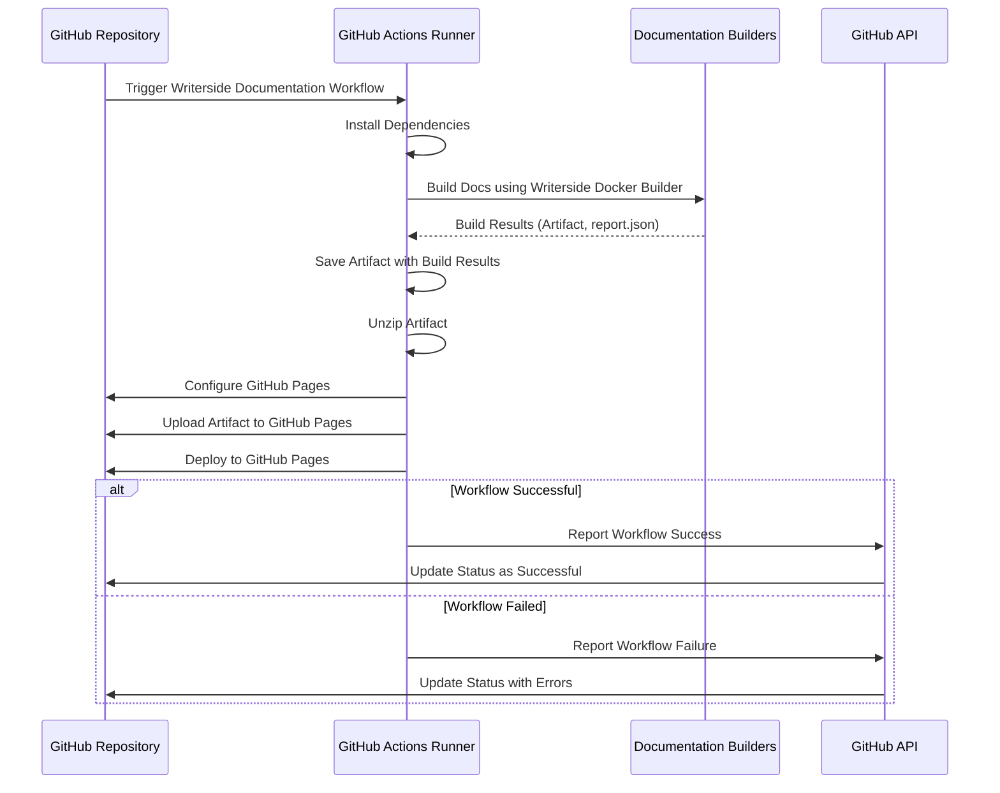

# Document

## Prerequisites

- [Download Writerside Jetbrains Plugin](https://plugins.jetbrains.com/plugin/20158-writerside)
  - [See how to add a Writerside instance](https://www.jetbrains.com/help/writerside/instances.html)
- **GitHub Pages**
  - Scroll down to the **Pages** section in the left sidebar.
  - Under **Build and deployment**, select **GitHub Actions** as the source.

## Consuming the workflow

```yaml
name: Writerside Documentation Pipeline

permissions:
  contents: write
  id-token: write
  pages: write
  pull-requests: write

jobs:
  document:
    uses: kurocado-studio/dev-ops/.github/workflows/workflow.document.yml@main
    secrets:
      GH_TOKEN: ${{ secrets.GITHUB_TOKEN }}
    with:
      instance_id: dcs
```

## Overview

Builds and deploys project documentation using Docker-based builders.


