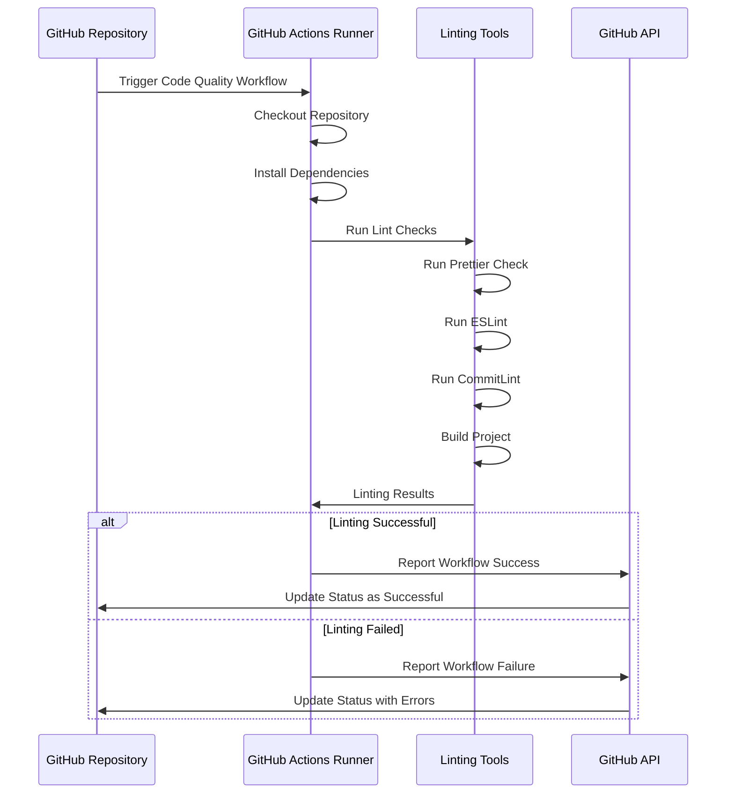

# Lint

## Prerequisites

- [Prettier](How-To-Install-Prettier.md)
- [ESLint](How-To-Install-ESLint.md)
- [CommitLint](How-To-Install-Commitlint.md)

## Consuming the workflow

```yaml
jobs:
  lint:
    uses: kurocado-studio/dev-ops/.github/workflows/workflow.lint.yml@main
    secrets:
      GITHUB_TOKEN: ${{ secrets.GITHUB_TOKEN }}
```

## Overview

The following sequence diagram illustrates the interactions and steps involved in the **Code
Quality** workflow.


