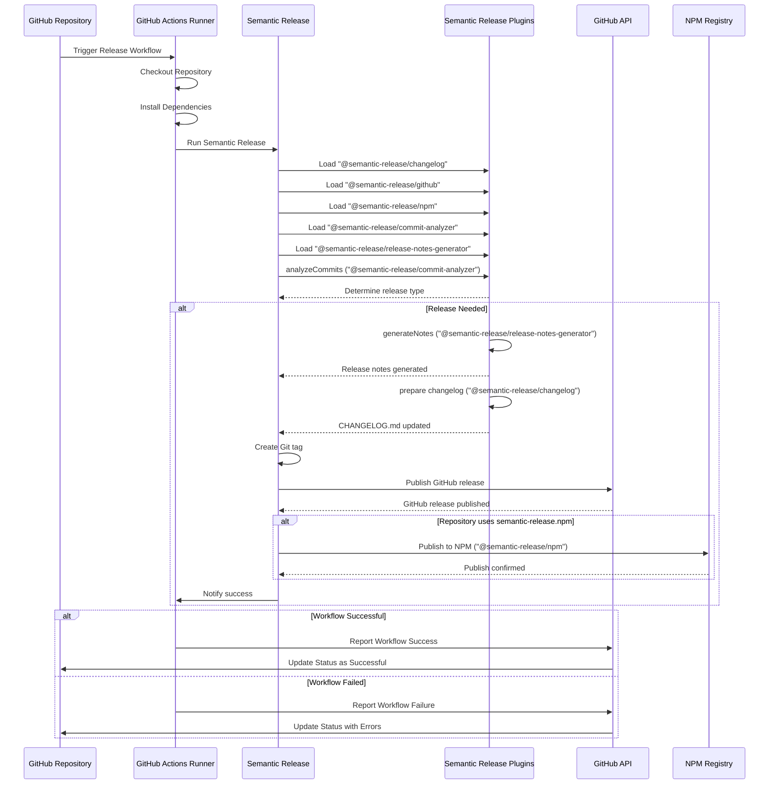

# Release

## Prerequisites

- [Semantic Release](https://kurocado-studio.github.io/styleguide/how-to-install-semantic-release.html)

## **Consuming the workflow**

```yaml
jobs:
  release:
    uses: kurocado-studio/dev-ops/.github/workflows/workflow.release.yml@main
    secrets:
      GITHUB_TOKEN: ${{ secrets.GITHUB_TOKEN }}
      NPM_TOKEN: ${{ secrets.NPM_TOKEN }}
    with:
      branch_name: ${{ github.ref_name }}
```

## Overview

Automates the release process, including versioning, changelog generation, and release notes.


